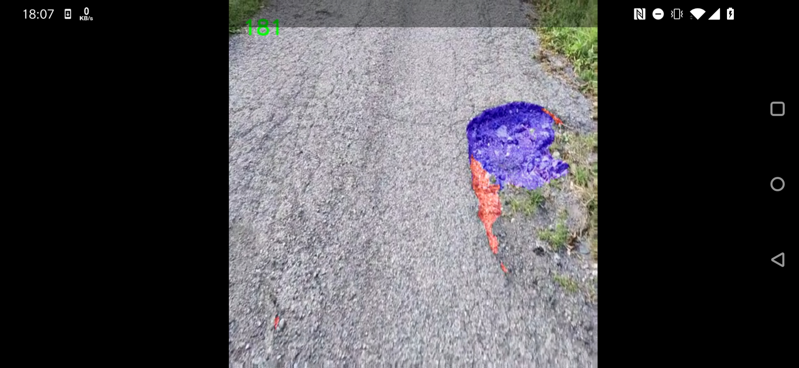

# Kivy OpenCV Demo
A simple demo program for using OpenCV on Android

{ style="width:800px;" }

## Build with:
> buildozer android debug deploy run

## Run (on desktop) with:
> python main.py -m screen:one

## Manually deploy on Android with:
> adb install -r bin/kivyopencvdemo-0.1-arm64-v8a-debug.apk

## Debug on Android with:
> adb shell logcat -s python
